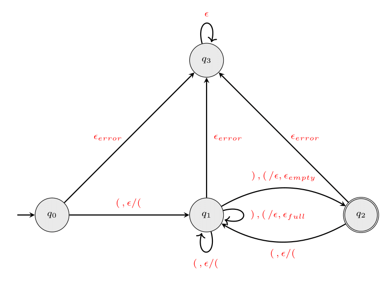

# Skladovni avtomat

Projekt vsebuje implementacijo skladovnega avtomata, ki omogoča preverjanje pravilnega gnezdenja oklepajev. Skladovni avtomat deluje tako, da ob vsaki pojavitvi oklepaja, bodisi navadnega, zavitega ali oglatega, ta oklepaj naloži na vrh sklada. Ob vsaki pojavitvi zaklepaja pa odstrani vrhnji oklepaj. V primeru, da se viden zaklepaj in vrhnji oklepaj na skladu ne ujemata, se bo avtomat premaknil v nesprejemno stanje, kjer bo tudi ostal. V primeru, da pridemo do konca niza brez napak, pa avtomat glede na sklad niz bodisi zavrne, če je sklad poln, bodisi sprejme, če je sklad prazen. Avtomat sprejema le nize sestavljene iz oklepajev ter zaklepajev vseh treh tipov.



## Matematična definicija

Skladovni avtomat je definiran kot nabor $(\Sigma, Q, q_0, F, \delta, \Gamma, Z)$, kjer so:

- $\Sigma$ množica simbolov oz. abeceda,
- $Q$ množica stanj,
- $q_0 \in Q$ začetno stanje,
- $F \subseteq Q$ množica sprejemnih stanj,
- $\delta : Q \times (\Sigma \cup \epsilon) \times \Gamma \to Q \times \Gamma^*$ prehodna funkcija,
- $\Gamma$ množica simbolov na skladu,
- $Z \in \Gamma$ začetni simbol na skladu.

Zgornji skladovni avtomat predstavimo z naborom $((,),[,],\{,\},q_0,q_1,q_2,q_3,q_0,q_2,\delta,(\, ,[\,,\{,\emptyset)$

Opomba: v tem projektu skladovni avtomat ni popoln, saj ne vključuje začetnega simbola na skladu. To pomeni, da je sklad na začetku prazen in začetni simbol na skladu ni definiran.

## Opis uporabljenih tipov in glavnih funkcij

### Struktura

Projekt sledi obliki in logiki s predavanj pri predmetu Programiranje 1 na Fakulteti za matematiko in fiziko.

Projekt je sestavljen iz map `src`, `html` in `diagram`:
- `diagram` vsebuje latex datoteko za grafično predstavitev avtomata,
- `html` vsebuje potrebne datoteke za predstavitev spletne strani avtomata,
- `src` vsebuje logiko za delovanje avtomata in je razdeljena na tri dodatne mape:
  - `definicije` vsebuje ocaml datoteke za avtomat, sklad, stanje, trak in zagnani avtomat,
  - `spletniVmesnik` vsebuje ocaml datoteke za implementacijo spletnega vmesnika za uporabo avtomata,
  - `tekstovniVmesnik` vsebuje ocaml datoteke za implementacijo tekstovnega vmesnika za uporabo avtomata.

### Tipi

- `type t = { avtomat : Avtomat.t; trak : Trak.t; stanje : Stanje.t; sklad : char Sklad.t }`
  - Glavni tip, ki predstavlja stanje skladovnega avtomata.
- `type 'a t = 'a list`
  - Tip, ki predstavlja sklad kot seznam elementov.

### Funkcije

#### `zagnaniAvtomat.ml`:

- `let pozeni avtomat trak = ...`
  - Inicializira skladovni avtomat z danim trakom.
- `let korak_naprej { avtomat; trak; stanje; sklad } = ...`
  - Izvede en korak avtomata glede na trenutni znak na traku.
- `let je_v_sprejemnem_stanju { avtomat; stanje; _ } = ...`
  - Preveri, ali je avtomat v sprejemnem stanju.

#### `sklad.ml`:

- `let prazen_sklad = []`
  - Ustvari prazen sklad.
- `let dodaj x sklad = x :: sklad`
  - Doda element na vrh sklada.
- `let odstrani = function | [] -> [] | _ :: xs -> xs`
  - Odstrani vrhnji element s sklada.
- `let vrh = function | [] -> None | x :: _ -> Some x`
  - Vrne vrhnji element sklada.
- `let je_prazen = function | [] -> true | _ -> false`
  - Preveri, ali je sklad prazen.
- `let vsebuje sklad = sklad`
  - Vrne seznam vseh elementov v skladu.

#### `avtomat.ml`:
- `prehodna_funkcija` 
    - bistvena funkcija za delovanje avtomata. Funkcija preverja skladnost oklepajev in zaklepajev in na podlagi vsebine sklada izvaja prehode med stanji.

```ocaml
let prehodna_funkcija avtomat sklad stanje znak =
  let stanje_q3 = Stanje.iz_niza "q3" in
  match
    List.find_opt
      (fun (stanje1, znak', _stanje2) -> stanje1 = stanje && znak = znak')
      avtomat.prehodi
  with
  | None -> None
  | Some (_, _, stanje2) -> (
      match Stanje.v_niz stanje with
      | "q3" ->
          Some (stanje_q3, sklad)
      | _ -> (
          match znak with
          | '(' | '{' | '[' -> Some (stanje2, Sklad.dodaj znak sklad)
          | ')' | '}' | ']' ->
              if
                Sklad.je_prazen sklad
                || Sklad.vrh sklad != ustrezni_odprti_oklepaj znak
              then Some (stanje_q3, sklad)
              else
                Some
                  (if Sklad.je_prazen (Sklad.odstrani sklad) then
                     (Stanje.iz_niza "q2", Sklad.odstrani sklad)
                   else (Stanje.iz_niza "q1", Sklad.odstrani sklad))
          | _ -> None))
```

#### `tekstovniVmesnik.ml`:
 - Implementira datoteke iz mape `src` in omogoča uporabo avtomata znotraj termina.

#### `spletniVmesnik.ml`:
 - Podobno kot `tekstovniVmesnik.ml` omogoča uporabo avtomata, le da nam ta predstavi grafično bolj prijazno obliko avtomata lokalno na spletu.

## Razlike glede na končne avtomate

Skladovni avtomati se razlikujejo od končnih avtomatov predvsem v tem, da imajo poleg stanj in prehodov tudi sklad, ki omogoča shranjevanje in dostopanje do vmesnih simbolov. Skladovni avtomat lahko v vsakem koraku prebere le en znak in vrh sklada. Glede na te informacije se odloči ali bo dodal znak na vrh sklada ali pa odstranil vrhnji element dol s sklada. Po izvedeni operaciji se izvede prehod v naslednje stanje.

## Navodila za uporabo

Implementacija omogoča preverjanje pravilnega gnezdenja oklepajev. Na voljo sta dva vmesnika, tekstovni in grafični. Oba prevedemo z ukazom `dune build`, ki v korenskem imeniku ustvari datoteko `tekstovniVmesnik.exe`, v imeniku `html` pa JavaScript datoteko `spletniVmesnik.bc.js`, ki se izvede, ko v brskalniku odpremo `spletniVmesnik.html`.

Če OCamla nimate nameščenega, lahko še vedno preizkusite tekstovni vmesnik prek ene od spletnih implementacij OCamla, najbolje <http://ocaml.besson.link/>, ki podpira branje s konzole. V tem primeru si na vrh datoteke `tekstovniVmesnik.ml` dodajte še vrstice

```ocaml
module Avtomat = struct
    (* celotna vsebina datoteke avtomat.ml *)
end
```

## Primeri uporabe skladovnega avtomata

### Niz: `()`

| Korak | Znak | Stanje | Sklad |
|-------|------|--------|-------|
| 1     | `(`  | `q1`   | `(`   |
| 2     | `)`  | `q2`   | ``    |
|       |      | **Sprejemno stanje:** `q2` | Niz je pravilno gnezden. |

### Niz: `((({[]})))`

| Korak | Znak | Stanje | Sklad           |
|-------|------|--------|-----------------|
| 1     | `(`  | `q1`   | `(`             |
| 2     | `(`  | `q1`   | `((`            |
| 3     | `(`  | `q1`   | `(((`           |
| 4     | `{`  | `q1`   | `{(((`          |
| 5     | `[`  | `q1`   | `[{(((`         |
| 6     | `]`  | `q1`   | `{(((`          |
| 7     | `}`  | `q1`   | `(((`           |
| 8     | `)`  | `q1`   | `((`            |
| 9     | `)`  | `q1`   | `(`             |
| 10    | `)`  | `q2`   | ``              |
|       |      | **Sprejemno stanje:** `q2` | Niz je pravilno gnezden. |

### Niz: `()[]{}`

| Korak | Znak | Stanje | Sklad |
|-------|------|--------|-------|
| 1     | `(`  | `q1`   | `(`   |
| 2     | `)`  | `q2`   | ``    |
| 3     | `[`  | `q1`   | `[`   |
| 4     | `]`  | `q2`   | ``    |
| 5     | `{`  | `q1`   | `{`   |
| 6     | `}`  | `q2`   | ``    |
|       |      | **Sprejemno stanje:** `q2` | Niz je pravilno gnezden. |

### Niz: `())({}`

| Korak | Znak | Stanje | Sklad |
|-------|------|--------|-------|
| 1     | `(`  | `q1`   | `(`   |
| 2     | `)`  | `q2`   | ``    |
| 3     | `)`  | `q3`   | ``    |
| 4     | `(`  | `q3`   | ``    |
| 5     | `{`  | `q3`   | ``    |
| 6     | `}`  | `q3`   | ``    |
|       |      | **Nesprejemno stanje:** `q3` | Niz ni pravilno gnezden. |

### Niz: `)(){}`

| Korak | Znak | Stanje | Sklad |
|-------|------|--------|-------|
| 1     | `)`  | `q3`   | ``    |
| 2     | `(`  | `q3`   | ``    |
| 3     | `)`  | `q3`   | ``    |
| 4     | `{`  | `q3`   | ``    |
| 5     | `}`  | `q3`   | ``    |
|       |      | **Nesprejemno stanje:** `q3` | Niz ni pravilno gnezden. |

### Niz: `((]]`

| Korak | Znak | Stanje | Sklad |
|-------|------|--------|-------|
| 1     | `(`  | `q1`   | `(`   |
| 2     | `(`  | `q1`   | `((`  |
| 3     | `]`  | `q3`   | `((`  |
| 4     | `]`  | `q3`   | `((`  |
|       |      | **Nesprejemno stanje:** `q3` | Niz ni pravilno gnezden. |

### Niz: `(()`

| Korak | Znak | Stanje | Sklad |
|-------|------|--------|-------|
| 1     | `(`  | `q1`   | `(`   |
| 2     | `(`  | `q1`   | `((`  |
| 3     | `)`  | `q1`   | `(`   |
|       |      | **Nesprejemno stanje:** `q1` | Niz ni pravilno gnezden. |